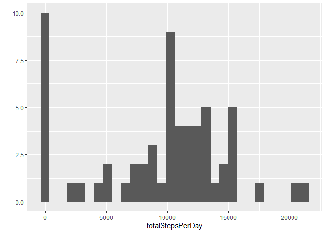
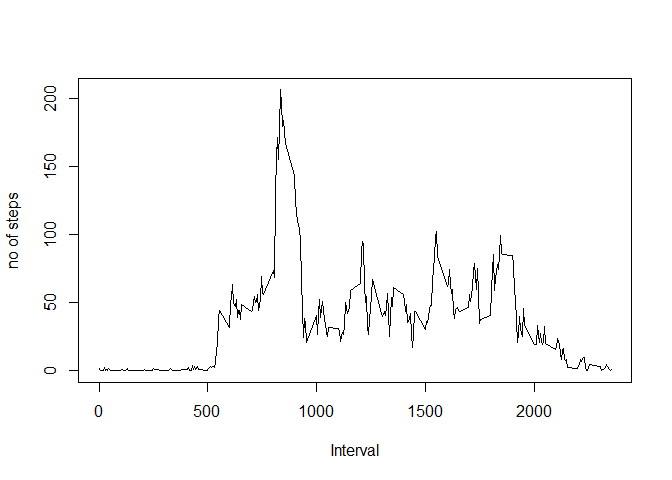
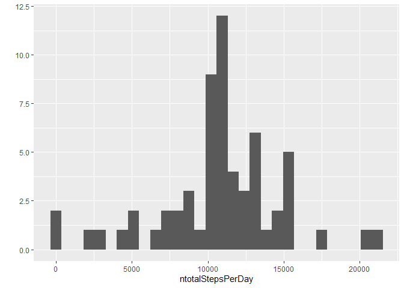
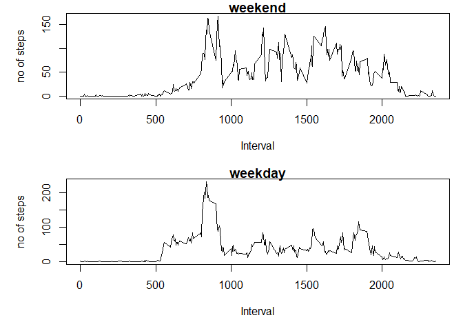

## Loading and preprocessing the data


```r
data<-read.csv("activity.csv")
data$date<-as.Date(data$date)
data$date<-as.factor(data$date)
data$interval<-as.factor(data$interval)
```

## What is mean total number of steps taken per day?

calculate total steps per day

```r
totalStepsPerDay=tapply(data$steps, data$date, sum,na.rm=TRUE)
```

Histogram for total steps per day

```r
library(ggplot2)
qplot(totalStepsPerDay)
```

```
## `stat_bin()` using `bins = 30`. Pick better value with `binwidth`.
```

<!-- -->

Mean of Total steps per day

```r
mean(totalStepsPerDay)
```

```
## [1] 9354.23
```

Meadian

```r
median(totalStepsPerDay)
```

```
## [1] 10395
```


## What is the average daily activity pattern?

Average of each interval across all days


```r
avgInterval<- tapply(data$steps,data$interval,mean,na.rm=TRUE)
plot(names(avgInterval),avgInterval,type = "l",ylab = "no of steps",xlab = "Interval")
```

<!-- -->

5-minute interval, on average across all the days in the dataset, contains the maximum number of steps


```r
names(which(avgInterval==max(avgInterval)))
```

```
## [1] "835"
```


## Imputing missing values

1. Total number of missing values in dataset

```r
sum(is.na(data$steps))
```

```
## [1] 2304
```

2. Impute the missing values with avg value of steps in that 5 min interval
3. create a new dataset ndata without NAs

```r
# avg interval imputation
ndata<-data

#index of missing values in dataset
naindex<-which(is.na(ndata$steps))

#avg steps for 5 min interval
avgInterval<- tapply(data$steps,data$interval,mean,na.rm=TRUE)

#impute the data
naVal<-NULL
for (i in naindex) {
  inter<-data[i,"interval"]
  me<-avgInterval[match(inter,names(avgInterval))]
  naVal<-append(naVal,me)
}

ndata[naindex,"steps"]<-naVal
```

4. 

calculate total steps per day for New Data

```r
ntotalStepsPerDay=tapply(ndata$steps, ndata$date, sum,na.rm=TRUE)
```

Histogram for total steps per day for New Data

```r
library(ggplot2)
qplot(ntotalStepsPerDay)
```

```
## `stat_bin()` using `bins = 30`. Pick better value with `binwidth`.
```

<!-- -->

Mean of Total steps per day

```r
mean(ntotalStepsPerDay)
```

```
## [1] 10766.19
```

Meadian

```r
median(ntotalStepsPerDay)
```

```
## [1] 10766.19
```

Impact of imputing missing values 
- Mean and median for total number of steps per day is increased 
- Total number of steps per day increased for days where there was missing data


## Are there differences in activity patterns between weekdays and weekends?

1. Create a new factor variable in the dataset with two levels – “weekday” and “weekend” indicating whether a given date is a weekday or weekend day.


```r
#create factor varialble weekday or weekend 
wday<-NULL

for (i in ndata$date) {
    w<-weekdays(as.Date(as.character(i)))
              
    if (w=="Saturday" | w=="Sunday"){
      wday<-append(wday,"weekend")
    }
    else{
      wday<-append(wday,"weekday")
    }
}

wday<-as.factor(wday)

#add column to data set 
ndata<-cbind(ndata,wday)
```

2. Panel plot containing a time series plot of the 5-minute interval (x-axis) and the average number of steps taken, averaged across all weekday days or weekend days (y-axis). 


```r
wavgInterval<- tapply(ndata[ndata$wday=="weekday","steps"],ndata[ndata$wday=="weekday","interval"],mean,na.rm=TRUE)

weavgInterval<- tapply(ndata[ndata$wday=="weekend","steps"],ndata[ndata$wday=="weekend","interval"],mean,na.rm=TRUE)

par(mfrow = c(2, 1),mar=c(5,5,1,1))
plot(names(weavgInterval),weavgInterval,type = "l",main = "weekend",ylab = "no of steps",xlab = "Interval")
plot(names(wavgInterval),wavgInterval,type = "l",main = "weekday",ylab = "no of steps",xlab = "Interval")
```

<!-- -->

